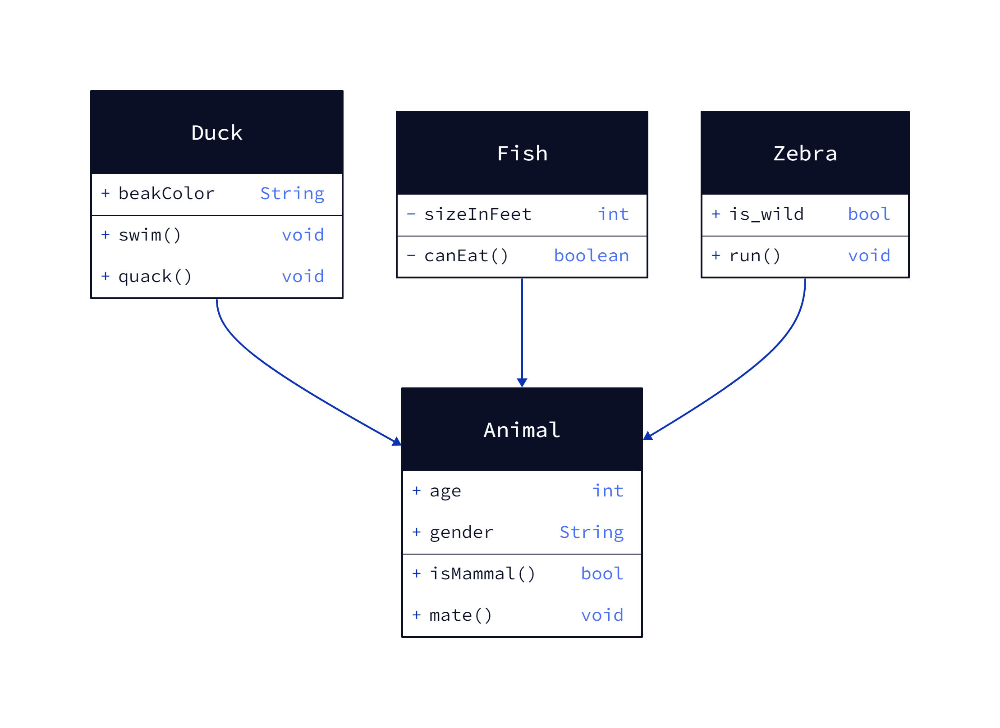

## D2
## environment requires
- choco installed via *PowerShell*
  - check: `choco install make`
- go installed via *.msi*
  - check: `go version`
- d2 installed via: `go install oss.terrastruct.com/d2@latest`
  - check: `d2 -v`
- d2 converting:
  - `d2 -w in.d2 out.svg` or `d2 -w in.d2 out.png`

## example
*file:*  
[class-diagram-example.d2](class-diagram-example.d2)

<details>
<summary>body:</summary>

```
Duck: {
    shape: class
    beakColor: String
    swim(): void
    quack(): void
  }
  Fish: {
    shape: class
    -sizeInFeet: int
    -canEat(): boolean
  }
  Zebra: {
    shape: class
    is_wild: bool
    run(): void
  }
  Animal: {
    shape: class
    age: int
    gender: String
    isMammal(): bool
    mate(): void
  }
  Duck -> Animal
  Fish -> Animal
  Zebra -> Animal
```
</details>

*validator:*  
[play.d2lang.com](https://play.d2lang.com/)

*preview:*
